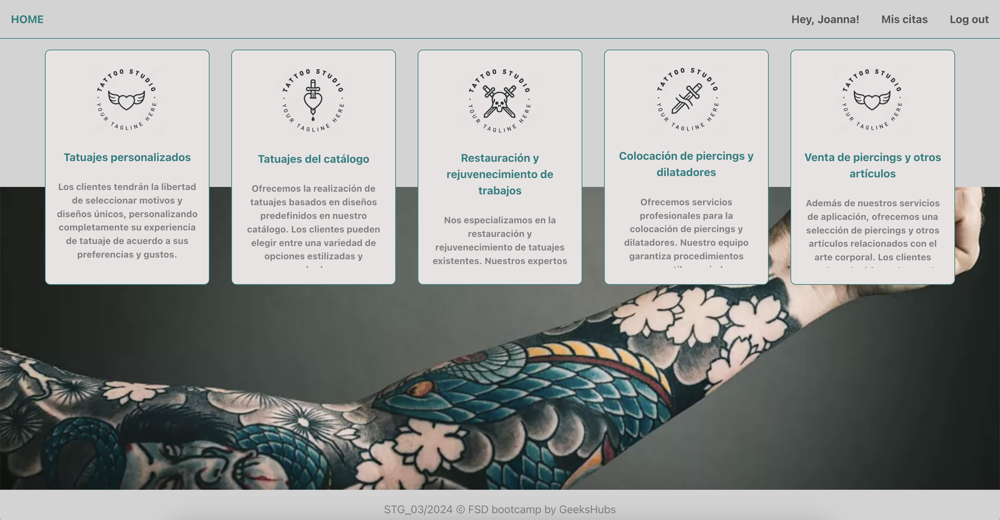
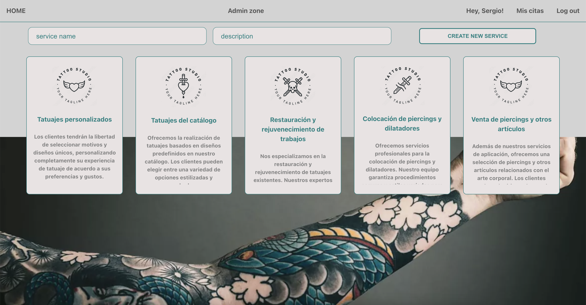
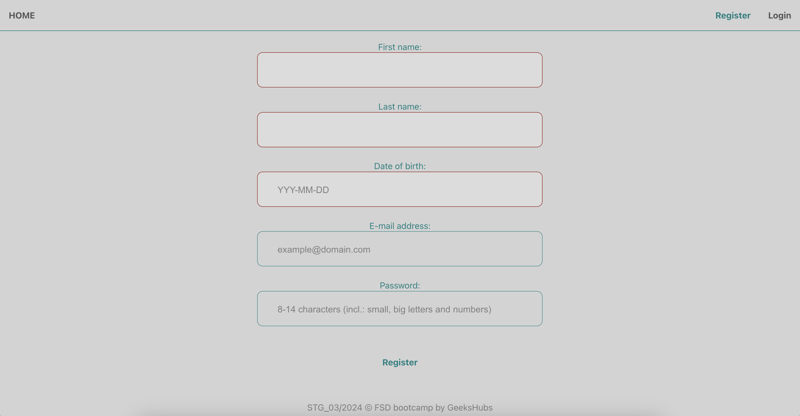
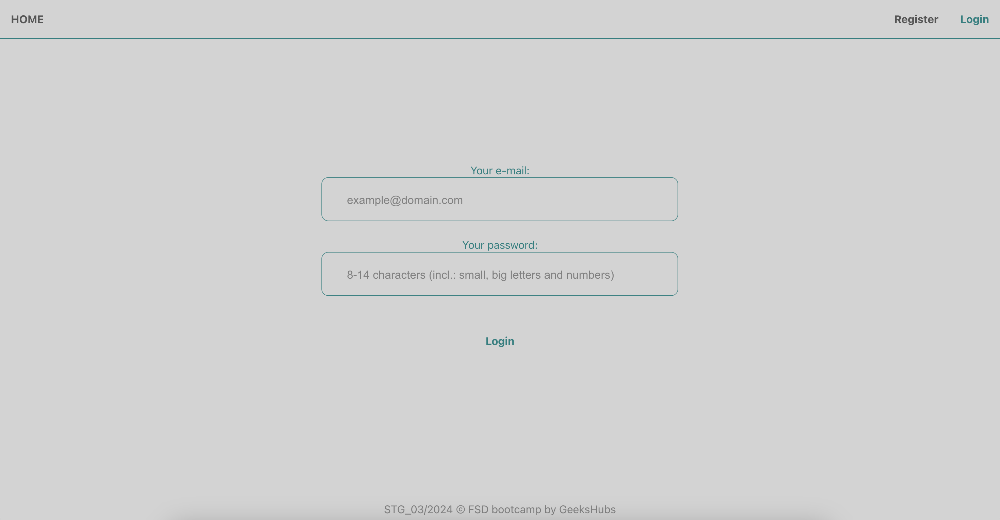
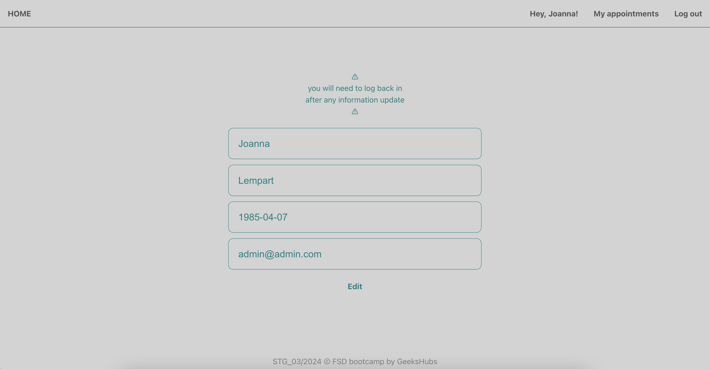
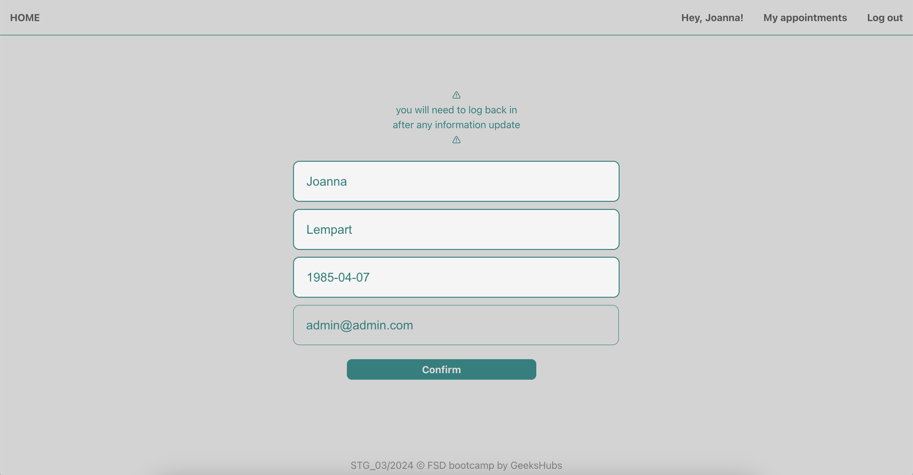
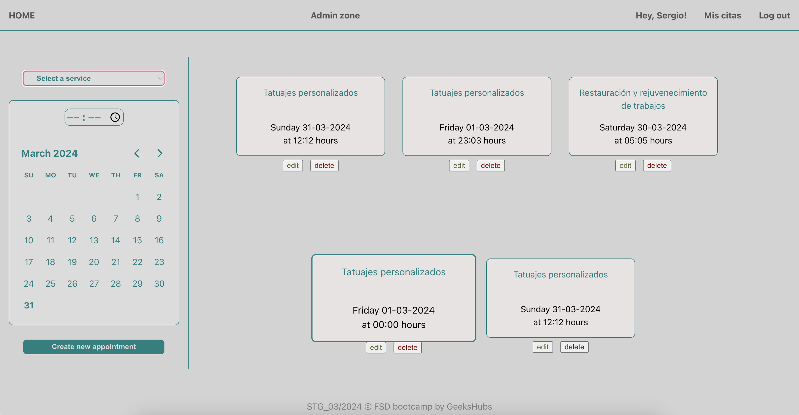
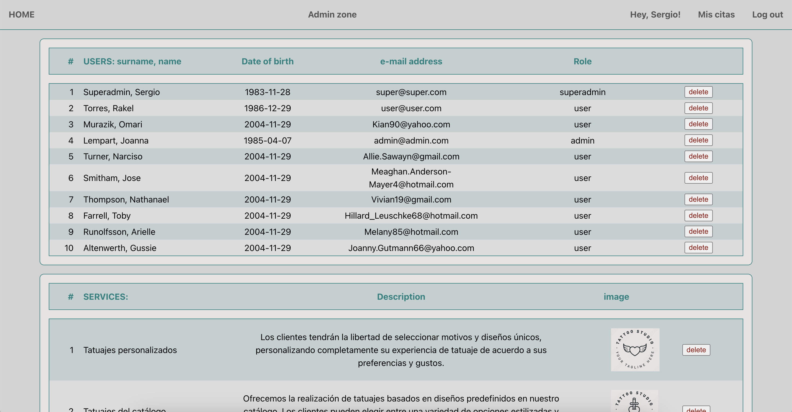

# TATTOO STUDIO web design

This is the SIXTH PROJECT of the Full Stack Development Bootcamp with <a href="https://github.com/GeeksHubsAcademy" target="_blank">Geekshubs Academy</a>.
A front-end site based on project number 4 of the bootcamp (<a href="https://github.com/SergioTorresGarcia/Proyecto4-Buscador" target="-blank">Tattoo studio searching engine</a>).  Made with React.


<br/><br/>
FRONT-END STACK: <br/>


BACK-END STACK:<br/>

<details>
  <summary>Table of Contents</summary>
  <ol>
    <li><a href="#project-description-es">Description (ES)</a></li>
    <li><a href="#challenge">Challenge</a></li>
    <li><a href="#instalation-local">Instalation</a></li>
    <!-- <li><a href="#deployment">Deployment</a></li> -->
    <li><a href="#views">Views</a></li>
    <li><a href="#future-improvements">Future improvements / New features</a></li>
    <li><a href="#contributions">Contributions</a></li>
    <li><a href="#author">Author / Contact </a></li>
  </ol>
</details>

## Project description (ES)
##### Services management tool for a tattoo studio (front-end side)

<details>
  <summary>Read about it (only in spanish)</summary>
  <br/>
<b>Front-end para una API de gestión de citas para un estudio de tatuajes:</b>
<br /><br />

En esta ocasión se nos requiere generar la parte frontal que conecte con nuestra API encargada de gestionar el modelo de negocio de un estudio de tatuajes.

Para ello, generaremos unas vistas sencillas que nos permitan registrarnos y logearnos como usuarios, ver nuestro perfil de usuario y modificarlo, así como ver nuestras citas. Además, necesitaremos poder ver los servicios que ofrece el estudio y poder concertar nuevas citas. 
Por último, debemos tener una vista de administrador desde la que se podrá acceder a la información de la aplicación y modificarla según proceda. 

En definitiva, tendremos que ser capaces de crear una parte frontal de la app lo suficientemente versátil como para que clientes, profesionales y un administrador puedan acceder y hacer uso de ella. 
</details>

## Challenge 🎯
The proposed exercise is to create a front-end site connecting to the Tattoo Studio API from a previous project.

##### Minimum viable product (MVP): 
✅ Landing page (home)
✅ User register
✅ User login
✅ Profile view (see info and update)
✅ Own appointments view (see info and delete)
✅ Service view (can be integrated in landing/home page)
✅ Create new appointments view (as User)
✅ See and delete users (as Admin)

##### Extras:
⬜️ Appointment detail view
⬜️ See an specific user (as Admin)
⬜️ Update user (as Admin)
⬜️ ( in progress ) Services CRUD (as Admin)
✅ ( partially❗️) Data validation (check all data format before sending it to the back-end...)
✅ ( partially❗️) Error handling (displaying helpful messages when an error occurs, both form-filling related errors and back-end failed requests/responses)


## Instalation (local)
1.  Clone this repository
2.  Run ` $ npm install ` in terminal
3.  Connect repository with database 
4.  `$ npm run dev`
<br/>
###### ⚠️ Since we will be fetching information from our own API from a previous project, here is how to install the back-end project and how to populate seeders - in case you run out of items to delete :) 

1.  Clone <a href="https://github.com/SergioTorresGarcia/Proyecto4-Buscador" target="-blank">this repository</a>
2.  Run ` $ npm install ` in terminal
3.  Connect repository with database 
4.  Run migrations:  ` $ npm run run-migrations `
5.  Run seeders:  ` $ npm run seeders `
6.  Start server:  ` $ npm run dev ` 
  


<!-- ## Deployment
<div align="center">
    <a href="https://www.google.com">
        <strong>Url a producción </strong>
    </a>🚀🚀🚀
</div> -->


## Views
Landing

<div>


</div>


Register / Login
<div>


</div>

See profile / Edit profile
<div>


</div>

Appointments


Admin



## Future improvements
⬜️ Appointment detail view
Appointment CRUD for Admin
Edit appointments as user (create, get and delete is done)
Add avatar/picture to profile

⬜️ See an specific user (as Admin)
⬜️ Update user (as Admin)
⬜️ ( in progress ) Services CRUD (as Admin)
✅ ( partially❗️) Data validation (check all data format before sending it to the back-end...)
✅ ( partially❗️) Error handling (displaying helpful messages when an error occurs, both form-filling related errors and back-end failed requests/responses)

## Contributions
If you have any comment or suggestion, feel free to reach out to me. My contact is down below.
Or you could as well either:

1. Open an 'issue' here in this project
2. Fork this repository
    - Create a new branch  
        ```
        $ git checkout -b feature/yourUserName-fix
        ```
    - Commit your changes 
        ```
        $ git commit -m 'feat: updating/fixing/improving whatever it is'
        ```
    - Push to the branch
        ```
        $ git push origin feature/yourUserName-fix
        ```
    - Create a Pull Request


## Author
<div align="center">
<a href = "mailto:a.sergiotorres@gmail.com"></a>
<a href="https://github.com/SergioTorresGarcia" target="_blank"></a> 
</div>